<style>
 body {
    /* font-family: "宋体", SimSun, serif; */
    font-size: 16px;
  }
   p {
    line-height: 1.7;
  }
</style>

# Jenkins
大多数互联网公司会使用Jenkins配合GitLab、Docker、K8s作为实现DevOps的核心工具。
> 用Jenkins把整个环境跑起来需要至少4台虚拟机，16GB以上的运行内存

持续集成（CI）：让软件代码可以持续集成到主干上，并自动构建和测试。

持续交付（CD）：让准备好发布的版本代码可以进行自动化部署。

使用Jenkins需要的前提技能：
- Docker
- Git

Jenkins安装：
- 服务器安装GitLab（准备环境）

- Jenkins宿主机安装Maven、JDK（需要配置）
- 通过Docker安装Jenkins
- 在Jenkins安装需要的插件（需要网络）
- 把jdk和maven挪到Jenkins的data目录并修改home目录


1、在Linux服务器上装GitLab服务端（后面Jenkins也是要装在Linux环境的）

2、研发人员和Jenkins都安装GitLab客户端，研发人员访问GitLab服务器推送研发完的代码，Jenkins访问GitLab服务器拉取代码


Windows安装Ubuntu虚拟机


## 服务器安装GitLab
1. <a herf="https://mirrors.tuna.tsinghua.edu.cn/gitlab-ce/yum/el7/">下载Gitlab的rpm包至本地</a>（本来要通过docker安装，但是网络下载不下来，就直接在服务器上安装了）

2. 使用yum安装gitlab
```bash
rpm -ivh gitlab-ce-16.11.8-ce.0.el7.x86_64.rpm
```
3. 编辑配置文件
```bash
vim /etc/gitlab/gitlab.rb
```
把里面的`external`值改为服务器的IP和端口（就是之后你通过浏览器访问的地址）

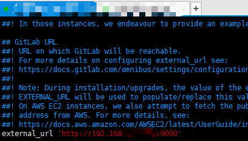

4. 启动GitLab
```bash
gitlab-ctl reconfigure
```
5. 查看默认登陆密码
```bash
cat /etc/gitlab/initial_root_password
```
6. 浏览器登录

访问地址就是gitlab.rb里配置的IP、端口，用户名就是root，密码就是你刚刚在上面看到的
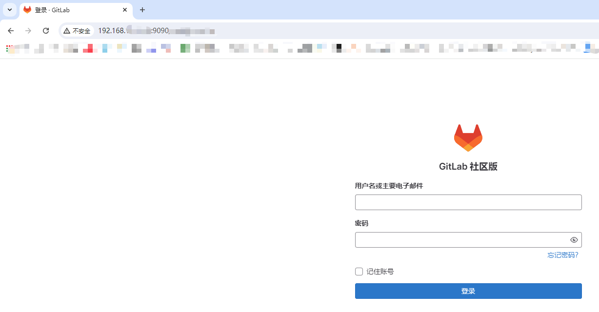


遇到的问题及解决方案：
- <a herf="https://www.cnblogs.com/Mr-Worlf/p/16572629.html">GitLab启动完成后访问不到页面</a>

## 宿主机通过Docker安装Jenkins
1. Docker下载jenkins社区版镜像
```bash
docker search jenkins/jenkins
docker pull jenkins/jenkins #下载需要等一会完成
docker images
```
2. 编辑docker-compose.yml
```bash
cd /usr/local/docker/jenkins_docker #这里是把docker-compose.yml单独放到了docker的jenkins文件夹里，实际使用时也可以放到springboot项目中
vim docker-compose.yml
```
内容如下：
```yml
version: "3.1"
services:
  jenkins:
    image: jenkins/jenkins
    container_name: jenkins
    ports:
      - 8080:8080
      - 50000:50000
    volumes:
      - ./data/:/var/jenkins_home/
```
3. 启动Jenkins
```bash
docker-compose up -d
docker logs -f jenkins #查看启动日志
```

4. 第一次启动会报错，没有data目录的权限，进行如下修改

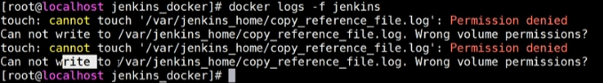
```bash
chmod -R 777 data
```
5. 重新启动
```bash
docker-compose up -d
docker logs -f jenkins #查看启动日志
```
等会就启动成功了
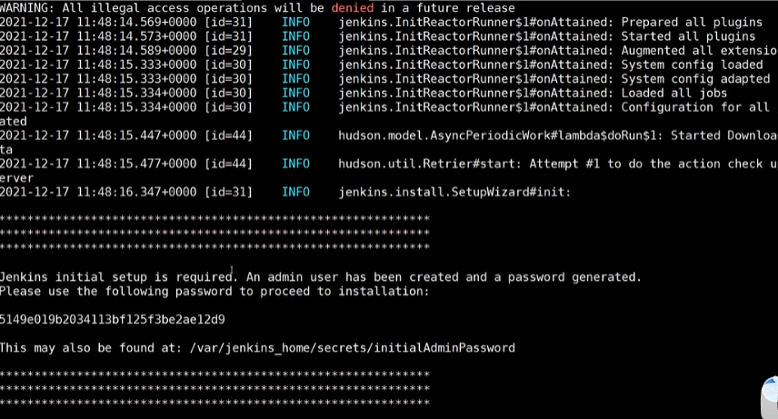
6. 浏览器访问，输入宿主机IP:刚刚在docker-compose.yml里配置的端口，用户名root，密码就是上面一步日志显示的
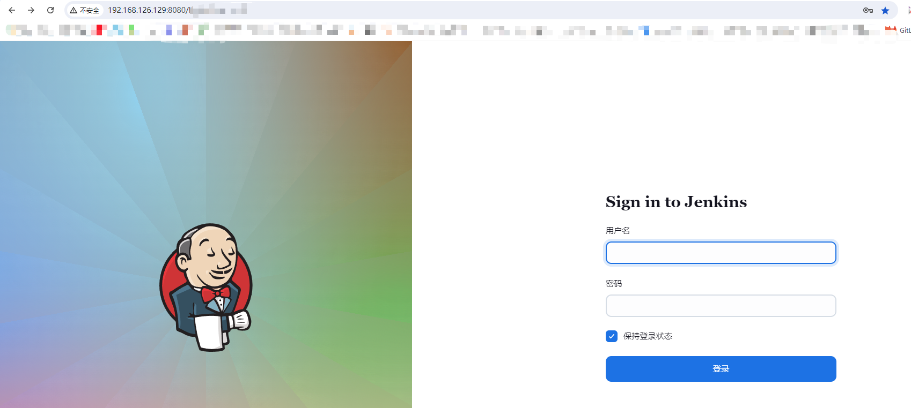

7. 安装常用Jenkins插件

- Git Parameter

- Publish Over SSH

- Locale

安装完插件之后重启Jenkins生效（方法是把浏览器地址后缀改为/restart，然后回车、确认重启）
## Jenkins安装Maven、JDK
1. 把Maven、JDK移动到Jenkins的data目录下

## Jenkins发布项目 --- （一）自定义流程构建方式

1. 配置GitLab代码仓库：推送本地代码到GitLab远程仓库

然后重新构建，然后查看构建日志，成功的话可以在

2. 配置Maven构建代码：构建jar包

GitLab代码仓库Build中选择maven，配置参数为
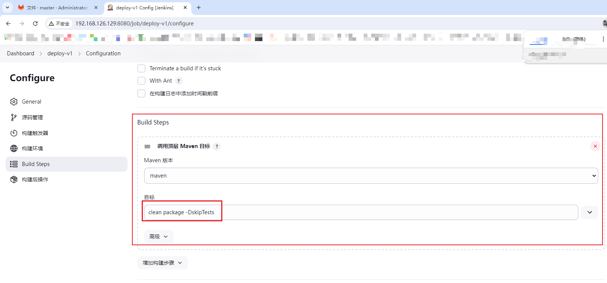

重新构建，然后查看构建日志，成功的话可以在target下看到构建好的jar包

3. 推送jar包到远程服务器：Publish Over SSH

3.1）配置目标服务器

在系统管理-全局设置中，配置SSH服务器，注意：需要加上密码，并测试连接。
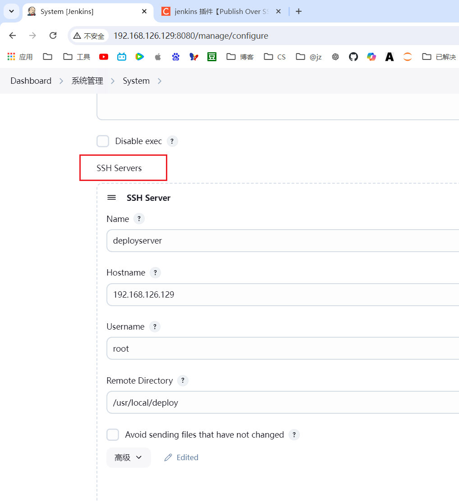

3.2）配置transfer jar包到目标服务器

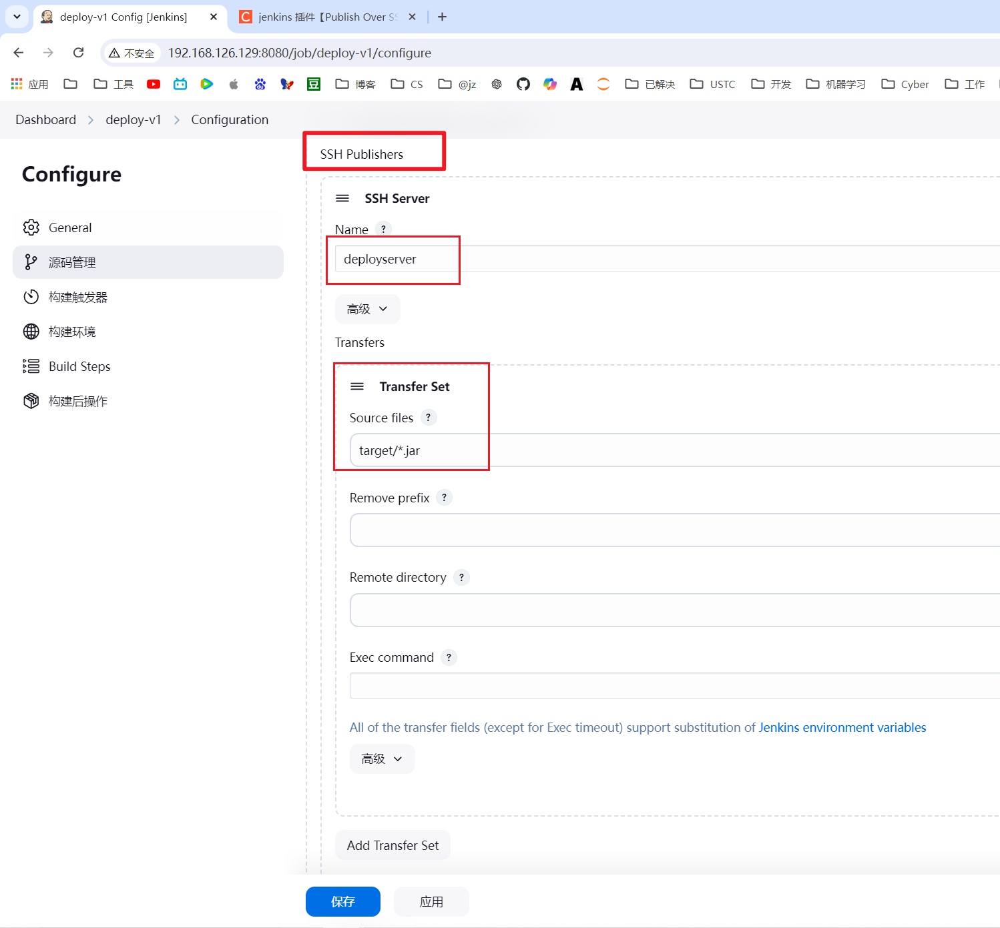

然后重新构建，就能在目标服务器的路径下看到jar包了 

3.3）设置自动生成镜像、自动运行容器

注意两个点：

- 写文件夹的绝对路径

- 运行端口不要和已经用的端口发生冲突

3.4）基于版本号拉取、构建项目 --- 实践中可以根据版本号快速把线上系统回滚到前一个版本

1、配置Git Parameter为根据tag拉取
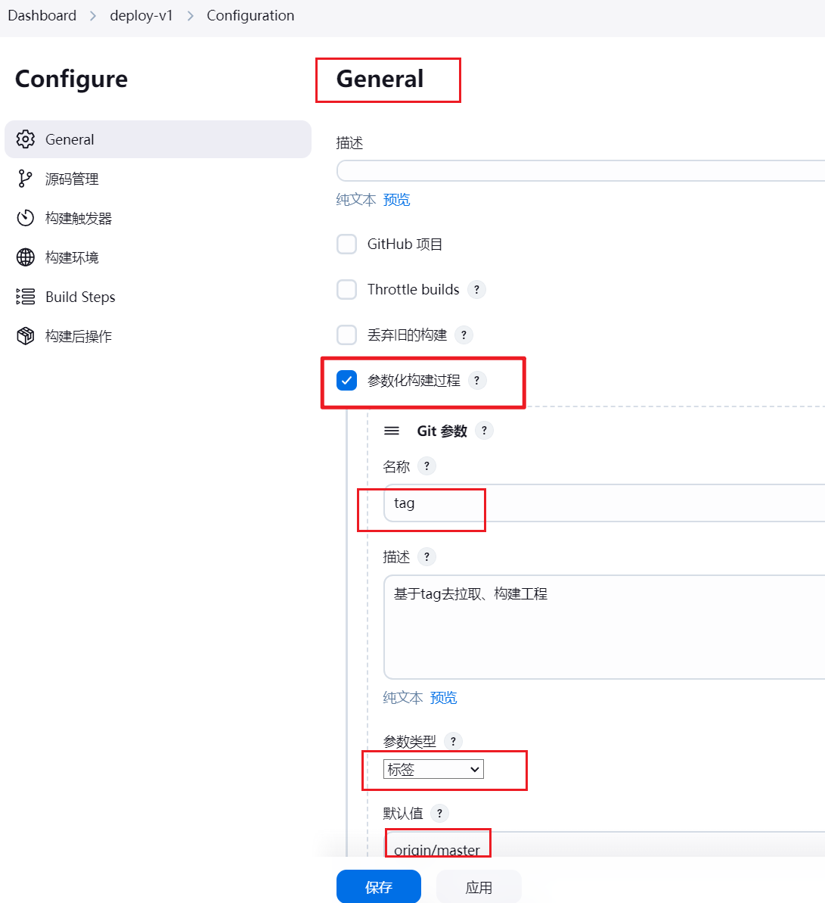

2、maven构建之前增加shell，根据代码tag构建相应版本的代码
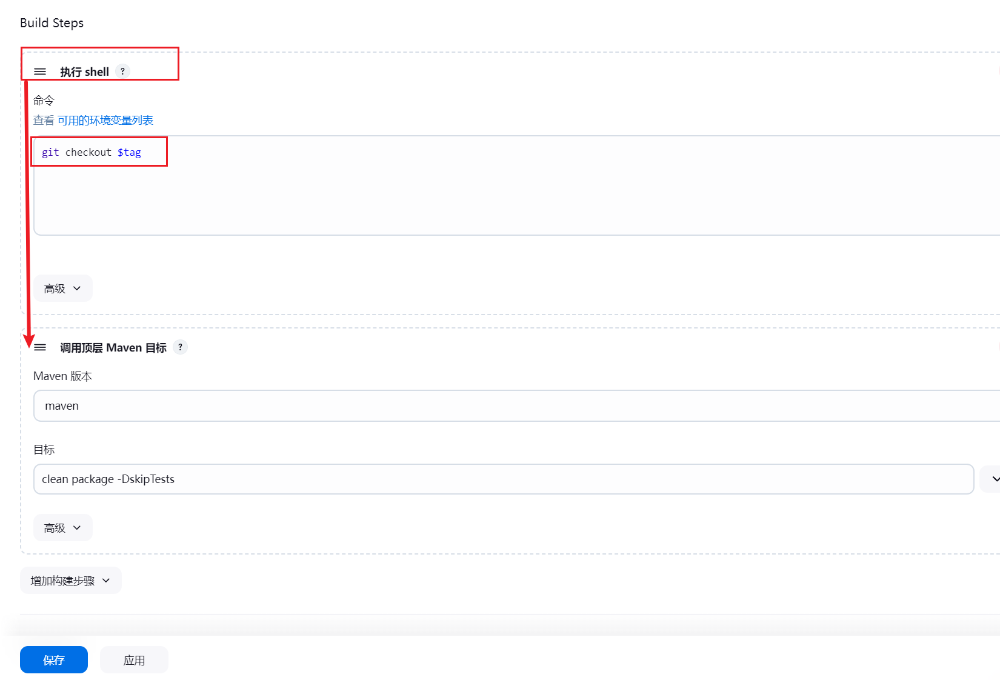

4. 集成SonarQube

下载SonarQube镜像，开启SonarQube容器
 

 5. 集成Harbor

5.1）手动推送镜像到Harbor

 想要把镜像推送到Harbor仓库中：

 1、镜像命名规则必须符合：`harbor地址/harbor项目名/镜像名:版本号`，然后才能将其推送到指定Harbor仓库中（注意：不是直接修改镜像名，还是同一个镜像，只不过该镜像追加一个符合上述规则的标识）
 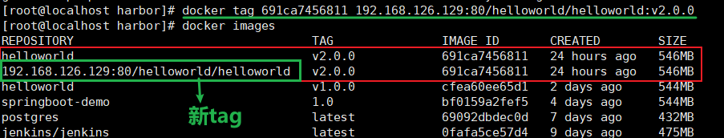

 2、在`daemon.json`中配置好Harbor地址
 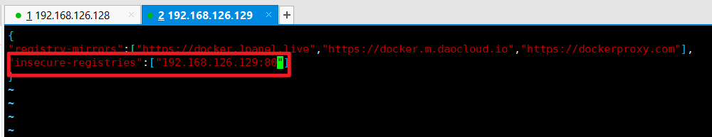
 注意重启Docker：`systemctl restart docker`

 3、登陆Harbor、推送
 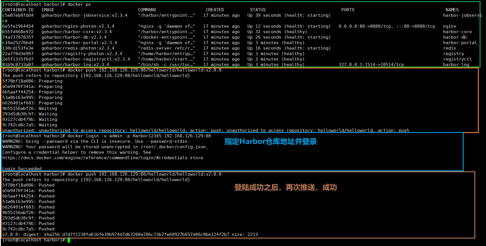

 4、测试从Harbor仓库拉取镜像到本地

 `docker pull harbor地址/harbor项目名/镜像名:版本号`

 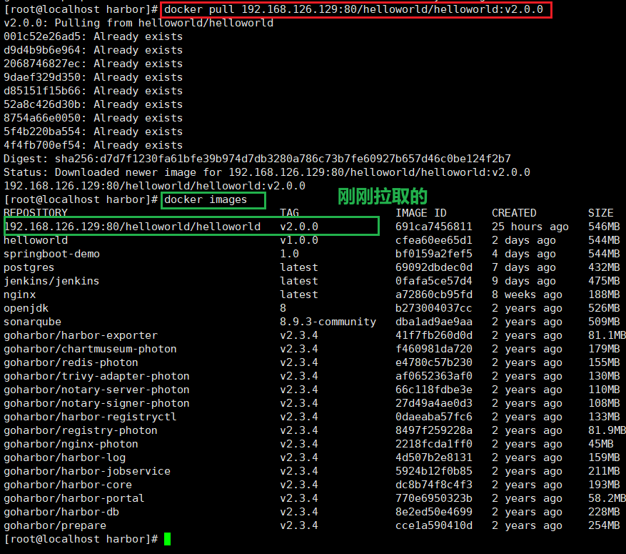

 > 这个`CREATED`是这个镜像最初始创建的时间，不是拉取时间。

5.2）自动推送镜像到Harbor

1、配置Jenkin能使用Dockers命令

- 设置文件`/var/run/docker.sock`的所属用户组和权限：

```bash
chown root:root docker.sock
chmod o+rw docker.sock
```
- 修改jenkins的docker-compose.yml文件中的目录映射：
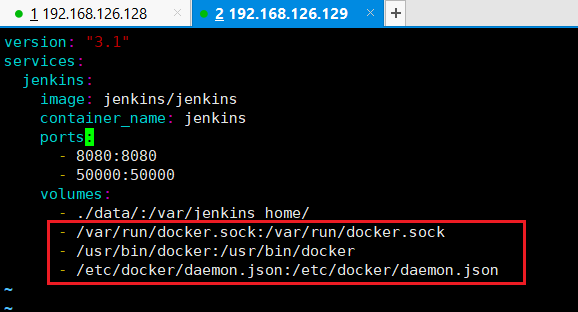

- 进入Jenkins内部执行docker命令看看能用吗
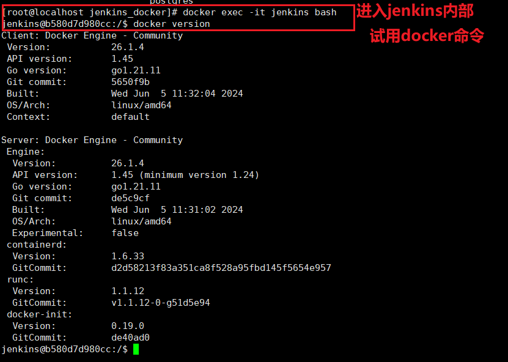

2、修改Jenkins流程

- 删掉“构建后部署”相关的文件传输、启动容器操作
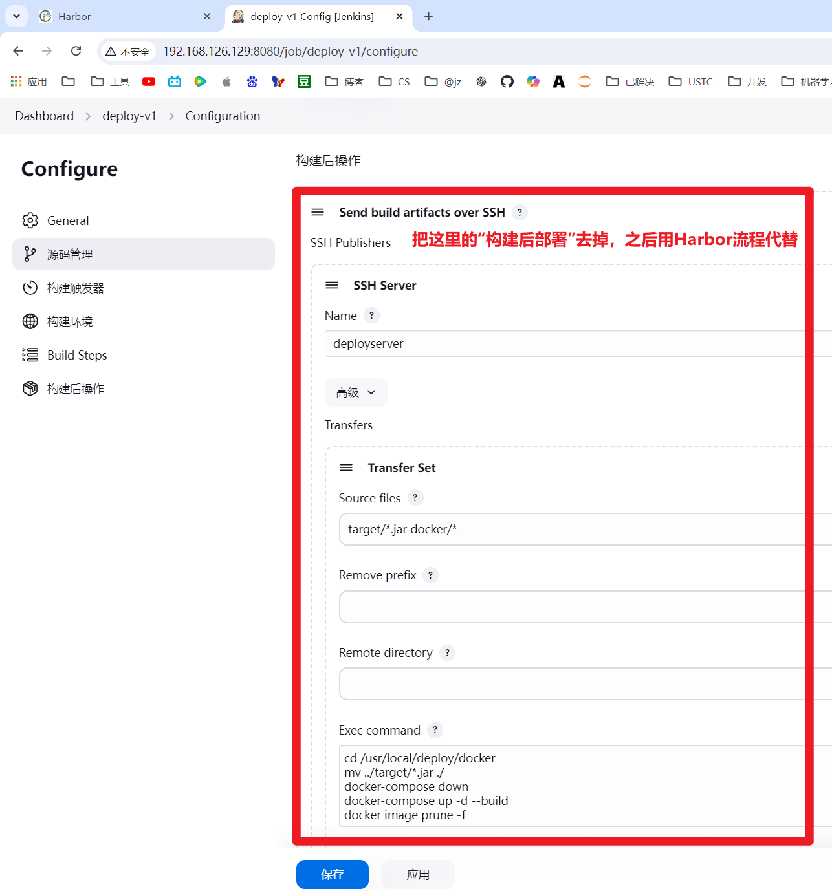

- 添加一步执行shell的步骤，用于制作部署包的镜像

<font color="red"> 注意：这个步骤一定要放在 构建后操作 - Send build artifacts over SSH，否则会一直报错找不到`deploy.sh`文件！！！</font>

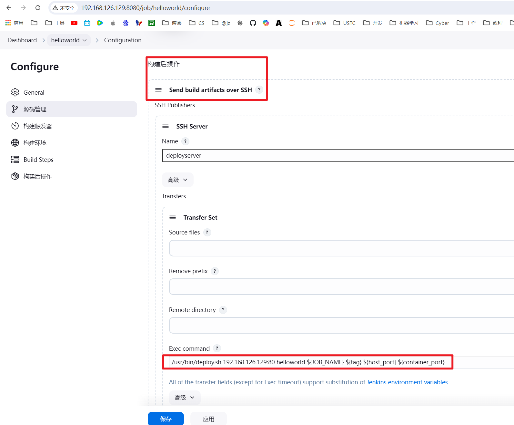

之前我放在了`Build Steps`里，一直报错找不到deploy.sh文件。。。

deploy.sh实现的功能：


deploy.sh样例：
```bash
#!/bin/bash

harbor_addr=$1
harbor_repo=$2
project=$3
version=$4
host_port=$5
container_port=$6

imageName=$harbor_addr/$harbor_repo/$project:$version

echo $imageName

containerId=`docker ps -a | grep ${project} | awk '{print $1}'`

echo $containerId

if [ "$containerId" != "" ] ; then
  docker stop $containerId
  docker rm $containerId
fi

tag=`docker images | grep ${project} | awk '{print $2}'`

echo $tag

if [[ "$tag" =~ "$version" ]] ; then
  docker rmi $imageName
fi

docker login -u admin -p Harbor12345 $harbor_addr

docker pull $imageName

docker run -d -p $host_port:$container_port --name $project $imageName

```

## Jenkins发布项目 --- （二）流水线方式
1、在Jenkins中安装插件`Pipeline Stage View`然后重启，可以看到阶段视图
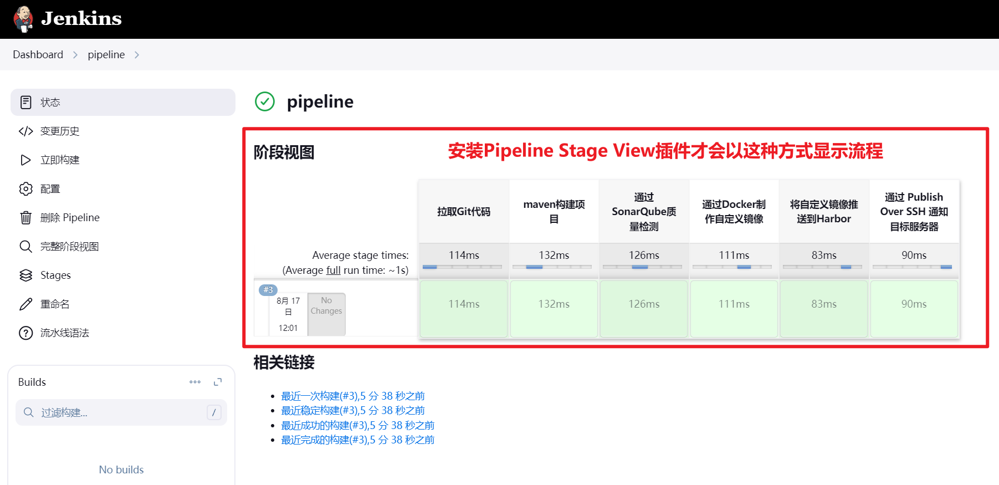

### 集成钉钉机器人
1、在钉钉群里加一个自定义机器人，记下关键词、webhook地址

2、在Jenkins安装`DingTalk`插件，然后配上这个地址

3、在流水线代码里加上状态通知逻辑

注意：post和stages是同级
```bash
    post {
            success {
                dingtalk(
                    robot: 'Jenkins-DingDing',
                    type: 'MARKDOWN',
                    title: "success: ${JOB_NAME}",
                    text: ["- 成功构建：${JOB_NAME}！ \n - 版本：${tag} \n - 持续时间：${currentBuild.durationString} "]
                )
            }
            failure {
                dingtalk(
                    robot: 'Jenkins-DingDing',
                    type: 'MARKDOWN',
                    title: "failed: ${JOB_NAME}",
                    text: ["- 构建失败：${JOB_NAME}！ \n - 版本：${tag} \n - 持续时间：${currentBuild.durationString} "]
                )
            }
        }

```

4、之后再构建代码，就会用钉钉机器人自动推送成功\失败的消息了
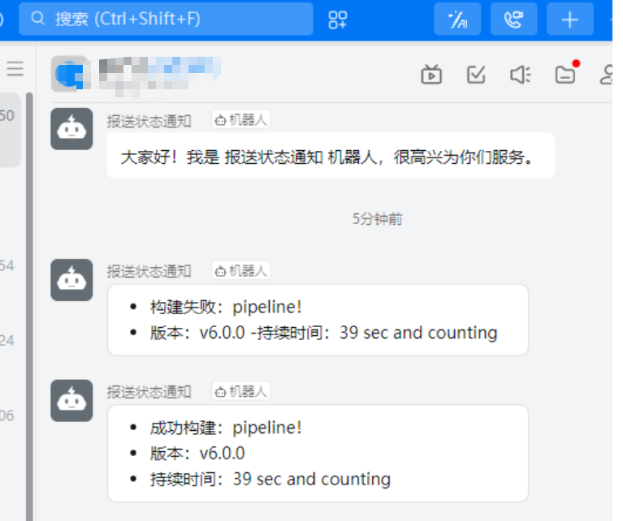


### 遇到的问题


- <b>Jenkins系统配置中配置GitLab时，正确输入了Gitlab host URL和Credentials，但是点击“Test Connection”时，始终报错Client error: HTTP 302 Found </b>


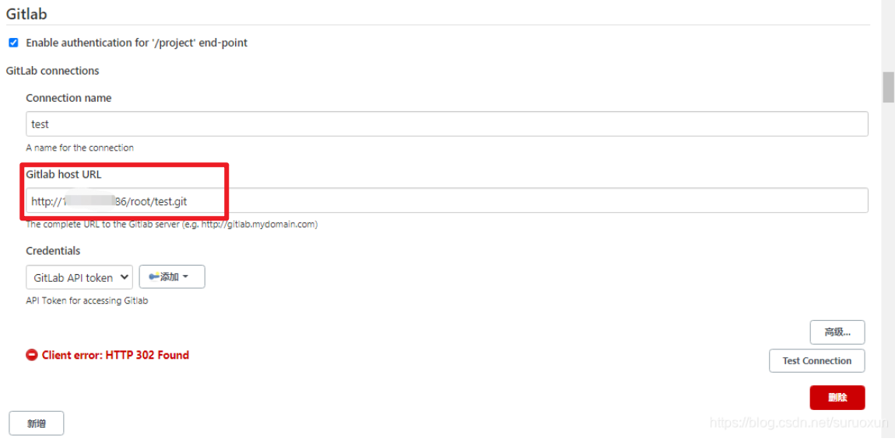

原因：host URL的问题

解决方法： host URL换成服务器的ip
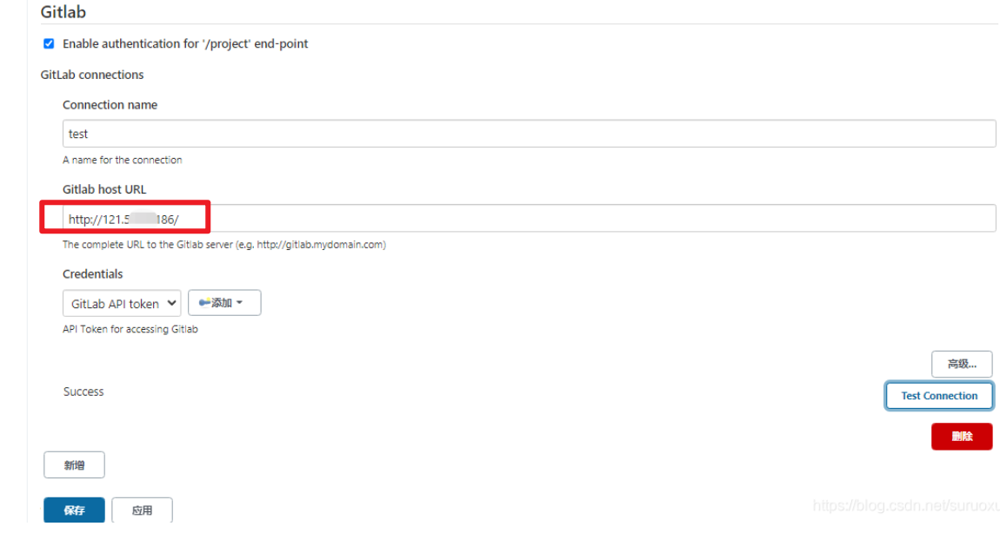

- <b>在SonarQube这一步，一直报错`ERROR: SonarQube server [http://localhost:9000] can not be reached`但我之前已经在Jenkins的全局配置中设置过SonarQube Server的IP，并且之前也能正常用。。。</b>

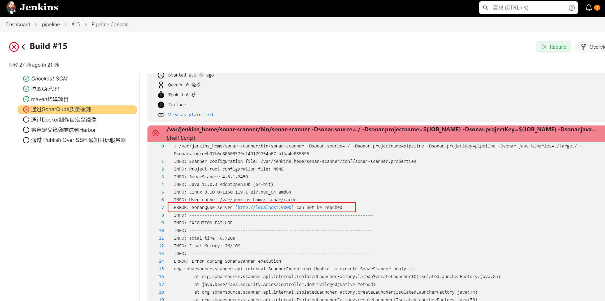

原因（GPT分析出来的）： Jenkins 全局配置未正确应用，如果你已经在 Jenkins 全局配置中配置了 SonarQube 的 IP 地址，确保在 Pipeline 脚本中正确使用该配置。

解决办法：在流水线语法中加入代码withSonarQubeEnv指定SonarCube容器名

之前代码：
```bash
// 3、通过SonarQube质量检测
        stage('通过SonarQube质量检测') {
            steps {
                  sh '/var/jenkins_home/sonar-scanner/bin/sonar-scanner -Dsonar.source=./ -Dsonar.projectname=${JOB_NAME} -Dsonar.projectKey=${JOB_NAME} -Dsonar.java.binaries=./target/ -Dsonar.login=b97b6c88608579e149179754b87fb1ba4e855896'
                  echo '通过SonarQube质量检测 - SUCCESS'
            }
        }

```
修改之后：
```bash
// 3、通过SonarQube质量检测
        stage('通过SonarQube质量检测') {
            steps {
                withSonarQubeEnv('sonarqube') {
                    sh '/var/jenkins_home/sonar-scanner/bin/sonar-scanner -Dsonar.source=./ -Dsonar.projectname=${JOB_NAME} -Dsonar.projectKey=${JOB_NAME} -Dsonar.java.binaries=./target/ -Dsonar.login=b97b6c88608579e149179754b87fb1ba4e855896'
                    echo '通过SonarQube质量检测 - SUCCESS'
                }
            }
        }
```

- <b> 通过流水线在部署最后这一步经常报错：ERROR: Exception when publishing, exception message [Exec exit status not zero. Status [125]]</b>
```bash
SSH: Connecting from host [b580d7d980cc]
SSH: Connecting with configuration [deploy129] ...
SSH: Creating session: username [root], hostname [192.168.126.129], port [22]
SSH: Connecting session ...
SSH: Connected
SSH: Opening exec channel ...
SSH: EXEC: channel open
SSH: EXEC: STDOUT/STDERR from command [deploy.sh $harborAddress $harborRepo pipeline v4.0.1 8085 8080] ...
SSH: EXEC: connected
pipeline/v4.0.1/8085:8080


WARNING! Using --password via the CLI is insecure. Use --password-stdin.
Error response from daemon: Get "https://pipeline/v2/": dial tcp: lookup pipeline on 192.168.126.2:53: no such host
Error response from daemon: pull access denied for pipeline/v4.0.1/8085, repository does not exist or may require 'docker login': denied: requested access to the resource is denied
docker: no port specified: :<empty>.
See 'docker run --help'.
SSH: EXEC: completed after 26,496 ms
SSH: Disconnecting configuration [deploy129] ...
ERROR: Exception when publishing, exception message [Exec exit status not zero. Status [125]]
[Pipeline] echo
通过 Publish Over SSH 通知目标服务器 - SUCCESS
```

原因一直不好查到。。。3个注意点：

1）在SSH server中设置 verbose 开启，这样构建日志会显示shell的详细错误日志

2）写流水线语法在部署这一步有错误，用的是jenkins自带的配置
我需要写的是这段：

`deploy.sh $harborAddress $harborRepo $JOB_NAME $tag $host_port $container_port`

流水线语法自动生成的是这样的：

```bash
sshPublisher(publishers: [sshPublisherDesc(configName: 'deploy129', transfers: [sshTransfer(cleanRemote: false, excludes: '', execCommand: 'deploy.sh $harborAddress $harborRepo $JOB_NAME $tag $host_port $container_port', execTimeout: 120000, flatten: false, makeEmptyDirs: false, noDefaultExcludes: false, patternSeparator: '[, ]+', remoteDirectory: '', remoteDirectorySDF: false, removePrefix: '', sourceFiles: '')], usePromotionTimestamp: false, useWorkspaceInPromotion: false, verbose: true)])
```

但是一直报错，ERROR: Exception when publishing, exception message [Exec exit status not zero. Status [125]]，经过GPT排查后，是生成代码里面`execCommand`后面的内容应该用双引号`"`而不是单引号`'`，修改如下才正常：

```bash
sshPublisher(publishers: [sshPublisherDesc(configName: 'deploy129', transfers: [sshTransfer(cleanRemote: false, excludes: '', execCommand: "deploy.sh $harborAddress $harborRepo $JOB_NAME $tag $host_port $container_port", execTimeout: 120000, flatten: false, makeEmptyDirs: false, noDefaultExcludes: false, patternSeparator: '[, ]+', remoteDirectory: '', remoteDirectorySDF: false, removePrefix: '', sourceFiles: '')], usePromotionTimestamp: false, useWorkspaceInPromotion: false, verbose: true)])
```

- <b> 整个流程都很顺利，但是，部署的代码版本并不是最新的，虽然确定GitLab中是最新代码、构建日志中也都是按最新tag拉取、构建的，但是最后在页面访问的时候还是旧版本 </b>
原因：缓存


解决方法：

1）docker build的时候加上参数 `--no-cache`

2）清除所有缓存！慎重！！需要确认，会删除所有未启动的容器的镜像！！！
`docker system prune -a`

3）流水线中用的相对路径不对，改为绝对路径之后就可以了。

比如：

```bash
mv ./target/*.jar ./docker/
docker build --no-cache -t $JOB_NAME:$tag ./docker/
```
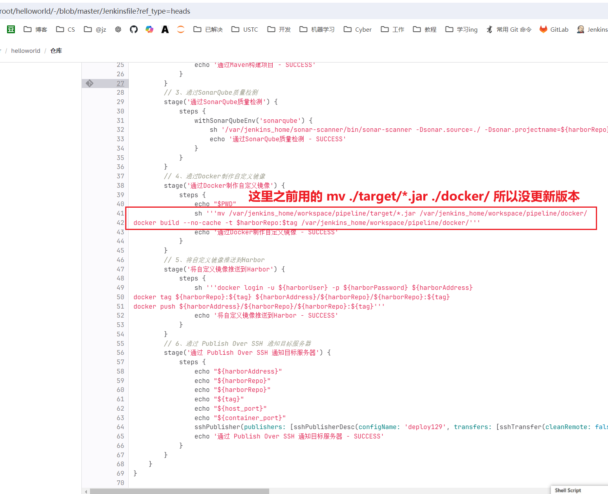

